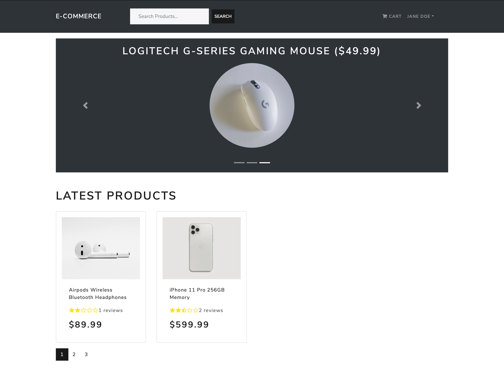

# Namaste Shop
E-commerce template focused on providing a platform for small businesses to go online with features including products catalog, product search, pagination, 
cart system, management dashboard for admins, and credit card payment system.

[View Live Site](https://eshop-namaste.herokuapp.com)

---

### Screenshot

---

### Technologies

- Front-end : 

  HTML5, CSS3, Javascript, Localstorage, Bootstrap, React, Redux, etc
  
- Back-end : 

  Nodejs, Express, JWT, bcrypt, morgan, multer, Mongoose, Mongodb.
  
- Tools: 

  Figma, Visual Studio Code, Postman, Git, Github.

---

### License

---

### Author Info

- Linkedin -- [Amit Karmacharya](https://www.linkedin.com/in/amit-karmacharya-b344731ab/)
